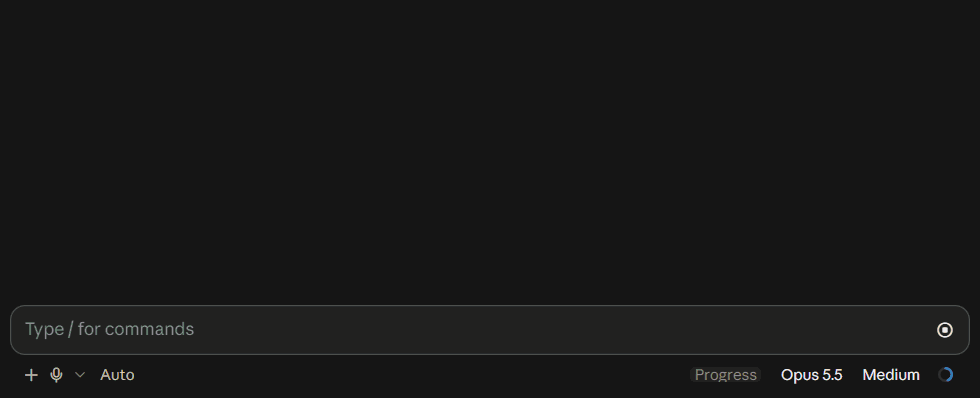

# Claude Code mods

## plan-progress

Live progress bars above the Claude Code prompt. Claude breaks medium and large tasks into stages and steps, and you watch them fill in real time, with the subagents working on each task right under its bar.



[Watch with sound (MP4, 14 s)](media/plan-progress.mp4)

- One thin row per task: state, title, pixel bar, percent, close button
- A pill on the bar shows the current stage and step count; hover it to see how long the plan has run
- Stage boundaries are capsules, steps are dots; hover a checkpoint to see when it was reached
- A finished bar turns green and its pill shows a check and the time the task took
- Four states in one brightness, white text readable on each: running (violet), needs input (amber), error (red), done (green)
- Subagents appear as strips under the task that started them: name, model and effort (`haiku 4.5`, `sonnet 5.5 · medium`), the tool in use, a live clock; a status change morphs in 200 ms and finished strips fold after 5 seconds
- The plan can be rewritten mid-run: resent stages keep finished steps by title, and the percent follows
- Bars survive closing the app: each session's bars are saved and come back when the session is resumed
- Soft sounds when Claude needs a decision, hits an error or finishes
- A **Progress** button in the footer is always there while the mod is loaded; it hides and shows the bars (in the terminal outside fullscreen, where clicks do not reach it, it is a plain label)
- A small bundled skill documents the tool for Claude, loaded only when needed

### Install

In Claude Code:

```
/plugin marketplace add zycck/claude-mods
/plugin install plan-progress@zycck-mods
```

Or copy `plugins/plan-progress` into `~/.claude/skills/plan-progress` to load it in every session.

### Commands

- `/progress` toggles the bars
- `/progress-demo` shows a sample bar
- `/progress-sounds` plays the three sounds
- `/progress-clear` removes all bars

### How it works

The mod registers a `plan_progress` tool. Claude creates a bar once with the full breakdown, then sends short updates such as `{id, next: true}` or `{id, done: ["Routes"]}`; a step name the bar does not have is refused with the list of its steps. Agent strips come from engine events alone and cost no tokens. Updates cost a few dozen tokens and the rules sit in the cached system prompt. A light gate asks Claude to create a bar before a task with several edits, and reminds it when a bar goes stale. A plan approved in plan mode becomes the bar `plan`.

The track is drawn as a still image and the hover parts sit in a see-through layer on top, so agent updates redraw only their own strip and nothing flickers.

In the terminal the bar is a `Raster` cell grid: braille dots for the pixel fill, the same twinkle periods as the desktop, a glide on step changes and a square pill, repainted with `$.ui.blit` about 30 times a second while Claude works on a bar or its agents run; a bar waiting on you or left open after the turn stands still. Its fill is one flat tone per bar, since the terminal palette holds a limited set of colour pairs and a per-cell gradient breaks into blocks. Outside fullscreen the terminal does not report clicks, so the close buttons are hidden there; `/progress` and `/progress-clear` do the same from the keyboard.

Built with Claude Code mods (function hooks).

### Tests

`plugins/plan-progress/tests` drives the real module through its hooks with a stub engine: `node compile.cjs ../hooks/register.tsx register.mjs`, then `node regress.mjs` and `node scenarios.mjs`. See its README.

## License

MIT
